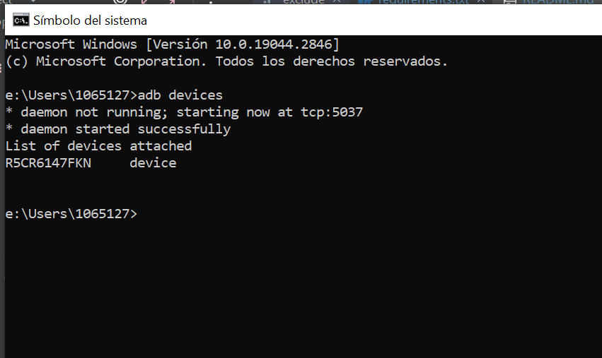
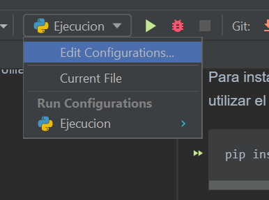
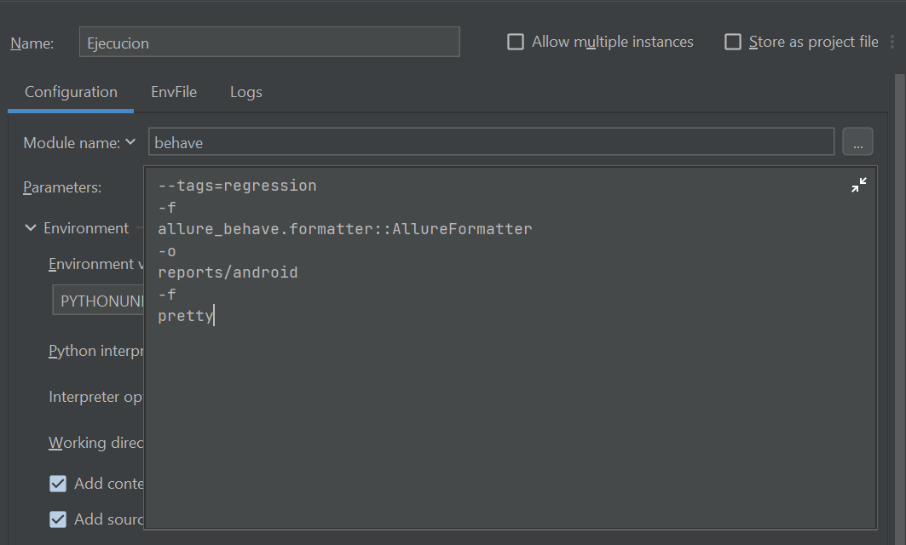
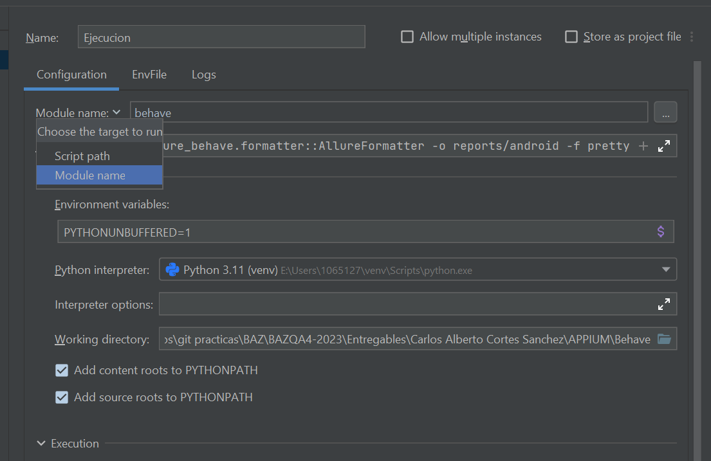
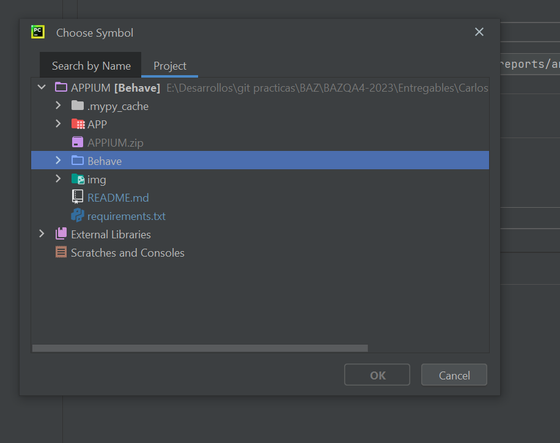
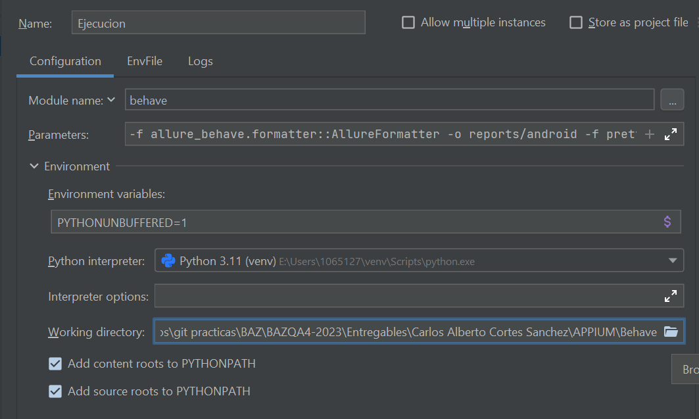

# Prueba de login, detalle de producto, ordenamiento de menor a mayor por precio del producto y compra del primer producto

Este proyecto contiene la automatización de casos de prueba del modulo de login,productos,el detalle de productos agregar el producto al carrito y la compra completa.
Para eso es necesario considerar la instalación de las siguientes herramientas de software.

* Python3
* Appium server
* Appium inspector
* IDE Pycharm community considerando la instalación de paquetes.
    * Appium-Python-client
    * Pytest
    * Flake8
    * Allure

## Python3
Entrar a la página oficial https://www.python.org/ y descargar de acuerdo al tipo de sistema operativo con el que se va a trabajar.  

## Appium server
Ingresar a la página oficial https://appium.io/downloads.html seleccionar Appium Desktop Apps mismo que direccionará a github para que descargue el ejecutable que corresponda a su sistema operativo.
Una vez instalado dejar los parametros por default Host y Port y oprimir el botón starServer

## Android Studio
Ingresar a la página oficial https://developer.android.com/studio?gclid=Cj0KCQjwu-KiBhCsARIsAPztUF1DYiog2Dd5_1GGKDOdCO3NJlHkStwRjJ2hs9-jhxr1-LNkxVrZgL4aAmcPEALw_wcB&gclsrc=aw.ds seleccionar el botón de descarga Android Studio Flamingo
Una vez instalado configurar las variables de entorno para poder hacer uso del sdk de adb devices

## Appium inspector
Para instalar appium inspector es necesario ingresar a la siguiente url https://github.com/appium/appium-inspector/releases mima que direcciona al repositorio que tiene los ejecutables de acuerdo a cada tipo de sistema operativo.   
Una vez instaldo confirmar que se tenga el mismo host y port que en appium server y agregar en el campo path lo siguiente `/wd/hub`  
  
Agregar el capabilitie de acuerdo a las caracteriticas de dipositivo agrego imagen de refrencia y el json de ejemplo:
  
```bash
{
        "platformName": "Android",
        "appium:platformVersion": "13",
        "appium:deviceName": "s21 ultra",
        "appium:automationName": "UiAutomator2",
        "appium:app": "e:\\Users\\carpet\\Downloads\\appPrueba.apk",
        "appium:appPackage": "com.saucelabs.mydemoapp.rn",
        "appium:appActivity": ".MainActivity"

    }
```
Nota: `platform_version` y `device_name` depende del modelo de dipositivo android a utilizar  

Una vez genrado el capabilitie
* Guardar el capabilitie
* Iniciar la sesión

## ¿Como obtener el nombre de dispositivo con ADB?
Para obtener el nombre del dispositivo se debe ejecutar el comando adb devices con el celular conectado y con el modo desarrollador activado. Debe mostrar el nombre del dispositivo una vez que se ejecute el comando
como se muestra en la imagen siguiente:



## IDE Pycharm Community
Ingresar a la página oficial https://www.jetbrains.com/es-es/pycharm/ y descargar el
ejecutable Community. Recuerde que durante la instalación se deben ambientar las variables de entorno.
El mismos ejecutable presenta una pantalla que permite la configuración de las variables de entorno. 

Una vez que se tenga el IDE, instalar los siguientes paquetes con el uso de la terminal.  
Nota: es importante antes instalar nodeJS para ejecutar los comandos con el prefijo npm. 


### Importar proyecto dentro del IDE
* Oprimir el menu File
* De la lista desplegada oprimir el botón Open
* Buscar el proyecto y oprimir la opción abrir


### Configuración del proyecto antes de correr el set de pruebas

Considerar los siguientes requerimientos [requirements.txt](requirements.txt)

Para instalar las dependencias utilizar el siguiente comando
  
 ```bash
pip install -r requirements.txt
``` 

## Set de pruebas

Para correr el set de pruebas debe tener la siguiente configuración 

* Se creo un una configuracion de ejecucion son el nombre: "Ejecucion" que ejecuta todos los casos de prueba

dentro del campo parameter colocar lo siguiente ya que en los feature tiene configurado el tag regression 

* ```bash
  --tags=regression
    -f
    allure_behave.formatter::AllureFormatter
    -o
    reports/android
    -f
    pretty
  ```  
Se accede a esa configuracion desde este menu:



En parameters agregar los siguientes tags



y se debe seleccionar la opcion "module name" apuntando al directorio behave del proyecto





El working directory debe apuntar al directorio behave del proyecto



listo al dar tap en el boton para correr ejecutarias los casos de prueba

## APP a probar
Se anexo la APP sauce_app.apk en el directorio APPIUM/APP por el tema de versiones diferentes y cambios en selecctores

### Para pruebas de regresion 
* Tener una nueva configuración en este caso se nombró regression
* Agregar el parametro `--tags=`(nombre del tag para identificar la prueba de regresion)
* 
### Pruebas de humo
* Tener una nueva configuración en este caso se nombró smoke
* Agregar el parametro `--tags=`(nombre del tag para identificar la prueba de regresion) como se muestra en la imagen.

Cada nuevo tag o etiqueta del tipo de prueba se debe colocar en los features especificamente en la parte superior del escenario(Scenario)
  
### Reportes Allure  

Para generar reporte desde cero con Allure, se deben seguir los siguientes pasos y comandos:

* Instalar allure en nuestra terminal de pycharm 
```bash
    pip install allure-behave
  ```  
Nota: en caso de que algun paquete no se instale correctamente desde el archivo requirements.txt se pueden instalar como lo hicimos con el comando anterior sustituyendo el nombre del paquete
* Agregar el paquete allure-behave
* Posicionarse hasta la carpeta Behave dentro de la terminal y correr los siguiente comando
```bash
allure serve reports/android
```

