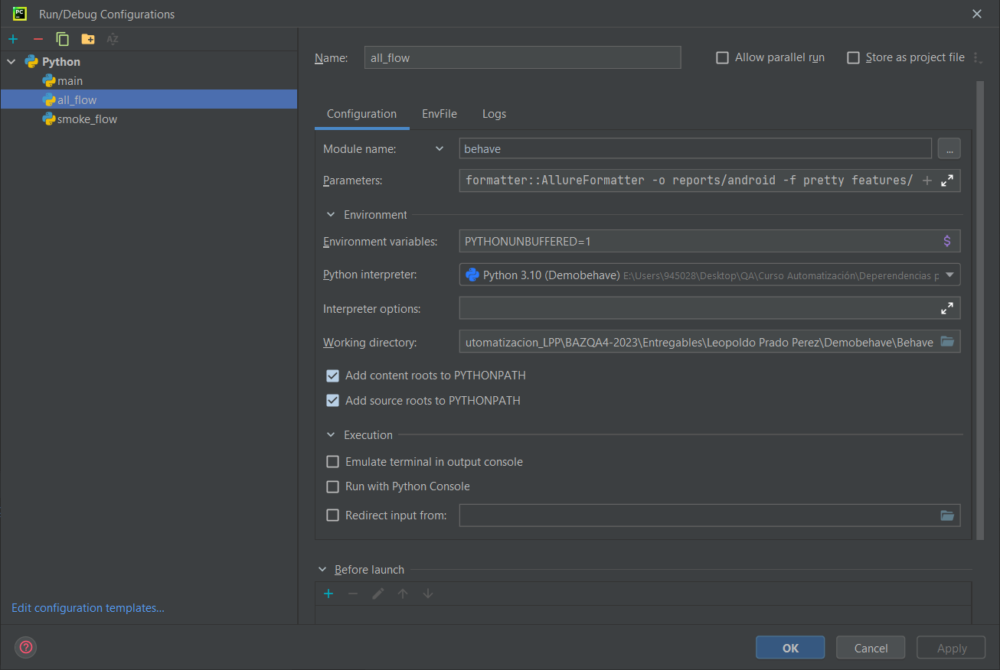
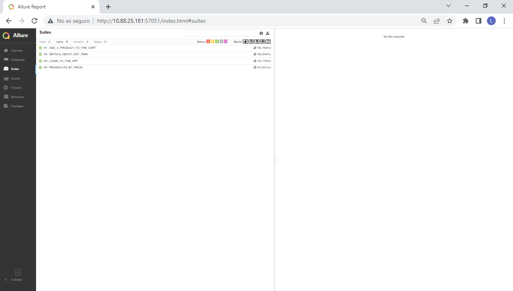
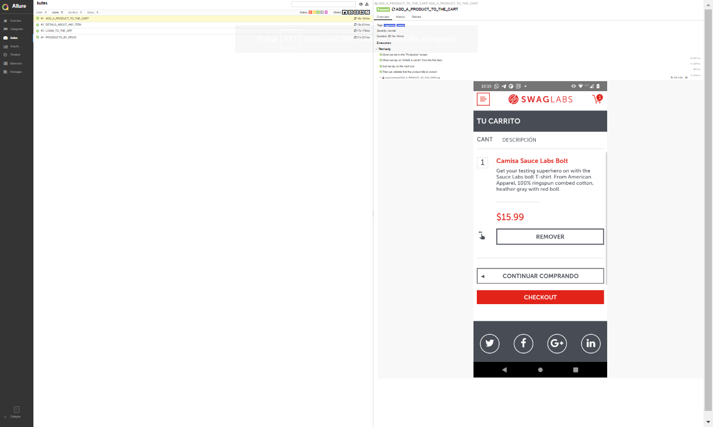
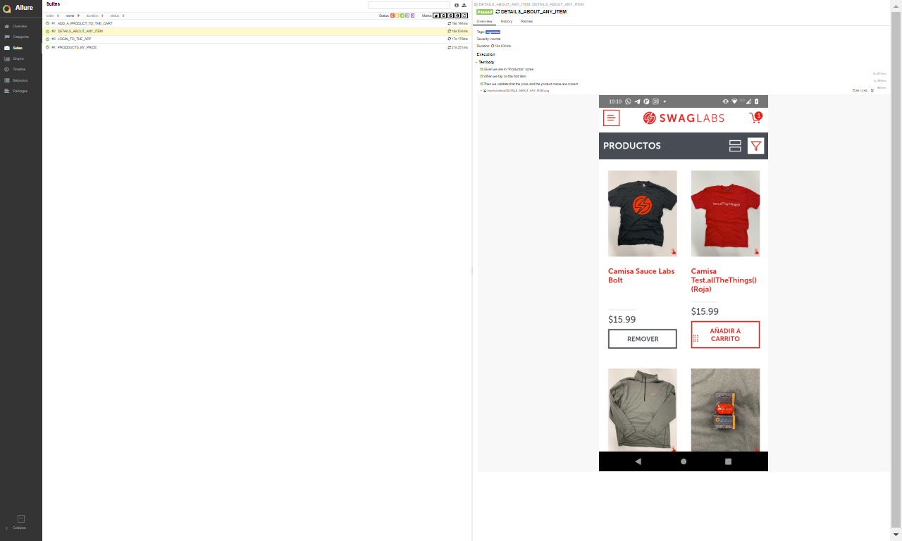
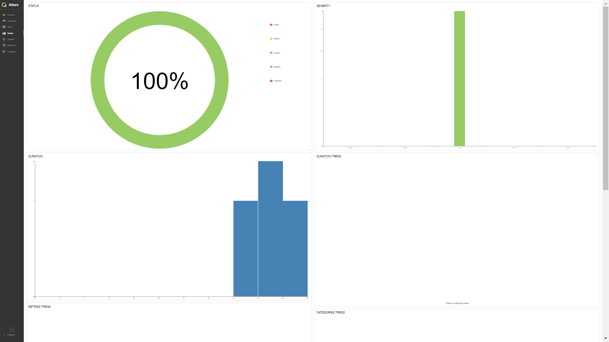

# 1 Proyecto APPIUM
	Proyecto de automatización para la aplicación SAUCE de Swaglabs en lenguaje Python y utilizando como IDE PyCharm,
	se pretende que el desarrollo sea lo más accesible para cualquier persona apoyándose en este documento que pretende
	presentar todos los elementos para su implementación.

	El framework cuenta Allure para los reporte genera durante la ejecución, hace uso de diccionarios para facilita el 
	manejo de datos, también cuenta con el uso de variables de entorno con el archivo .env para el manejo de datos 
	sensibles como contraseñas y otros.

# 2 Tools
	Herramienta necesaria para la ejecución del framework
    * Behave == 1.2.3
    * Appium-Python-Cliente==2.9.0
    * allure-behave==1.13.2
    * Python-dotenv==1.0.0
    * PyCharm ==2022.1.3
# 3 Installation
	Importante la ejecución de los siguientes comandos:
    py.test --alluredir=%reportes%
    pip install Python-decouple
    pip install -r requirements.txt
    pip install Appium-Python-Client
	pip install pytest

	No olvidar cambiar la configuración con los siguientes parámetros en edit configuration
	en el campo Parameters:
		--tags=e2e
   	 	-f
    	allure_behave.formatter::AllureFormatter
   		-o
   		reports/android
   		-f
   		pretty
   		features/
**Utilizar los siguietes parámetros para el run configuration:**

## 3.1 Executing the framework
    Para la ejecución de la prueba se debe contar con los siguiente:
        *adb divices
		*IDE: PyCharma
		*Appium Server en ejecución
		*Appium inspector
		*Alguna app para control remoto del dispositivo (Vysor, ApoweMirror, etc)
    
    Para la Ejecución de las pruebas es necesario iniciar los siguiente: 
	1. Descargar en el dispositivo el APK sauce_app.apk
	2. Descargar el proyecto en el equipo a donde se ejecutará 
	3. Ejecutar la herramienta Appium Server GUI (interfaz entre la APP y el proyecto)
	3. Ejecutar PyCharm
    4. Editar el archivo .env como el ejemplo .env_sample de acuerdo a los valores a utilizar, ejemplo:
        STANDARD_USER=""
        PASSWORD=""
	5. Abrir el proyecto, para este caso Demobehave
	6. Seleccionar runer deseado desde el Run configuration
		a) all_flow para ejecutar todos los escenarios
		b) smoke_flow solo para ejecutar los escenarios de smoke

**Nota:** Ejecutar en la terminal el comando adb divices para obtener el nombre del dispositivo físico se utilizá para la ejecución.

# 4 Technology Stack
        *IDE: PyCharma
		*Appium Server
		*Appium inspector
        *Vysor
        *ApoweMirror
        *Android Studio

# 5 Folder Structure
     Behave/
	├── APP/
	│      ├──sauce_app.apk	
	├── features/
	│      ├── add_a_product_to_the_cart.feature
	│      ├── details_about_any_item.feature
	│      ├── log_in.feature
	│      ├── tap_over_filter.feature
	├── reports/
	│      ├──android	
	├── screens/
	│      ├── add_a_product_to_the_cart_sreen.py
	│      ├── details_about_any_item_sreen.py
	│      ├── log_in_sreen.py
	│      ├── tap_over_filter_sreen.py
	├── steps/
	│      ├── add_a_product_to_the_cart_steps.py
	│      ├── details_about_any_item_steps.py
	│      ├── log_in_steps.py
	│      ├── tap_over_filter_steps.py
	├── utils/
	│      ├── dictionaries/
	│      │    	├── details_about_first_item_dic.py
	│      ├── base_actions.py
	│      ├── .env
	│      ├── environment.py
	│         
	├── venv/
	       ├──── README.md
               └── requirements.txt
   

# 6 Results
	Generación de reporte:
	El framework cuenta con Allure para la obtención del reporte de la ejecución y se obtiene 
	ejecutando el comando .../Behave/allure serve reports/android, al ejecutar el comando se abrirá una página en explorador 
	determinado con los reportes.
**Nota:** El comado allure debe correr justo en la carperta Behave del proyecto.

