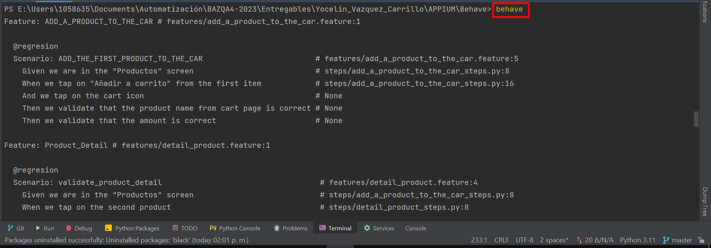
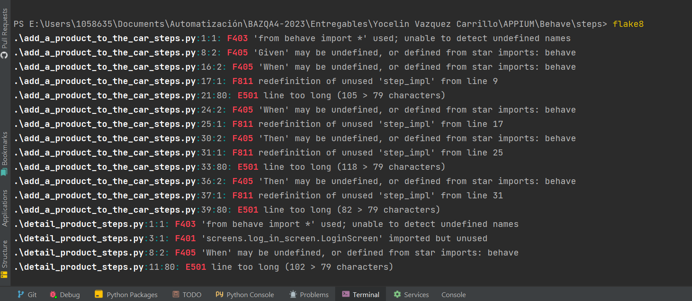

# Mi Pokémon Favorito API
 
Mi Pokémon Favorito API es una collección de Postman de solicitudes request 

Esta es una API solo de consumo : solo el método HTTP GET está disponible en los recursos.

## Comenzando 🚀

Collection [API](https://github.com/wizelineacademy/BAZQA4-2023/pull/9/commits/61d04ed1265f67ceeff2ba6708f1898aaad73a55#diff-8257cbce4873cf7a753b69f6994cc8358fa02b2464e5271fc4bcce7c2b5f6792)

### Pre-requisitos 📋

-Tener instalado POSTMAN


### Instalación 🔧

 - Ingresar a la página oficial 
 [Postman](https://www.postman.com/downloads/?utm_source=postman-home)
- Descargar la aplicación Postman según el SO


## Ejecutando las pruebas ⚙️

### Collection:

EndPoints:
  * Consulta de Pokémon
  * Pokémon favorito
  * Consulta de movimiento por nombre
  * Consulta de movimiento por ID 


### Contenido Endpoint 🔩

-- Endpoint 1 - Consulta de Pokémon (pokémon Favorito): 

TEST:
* 1.- Validar de Mi pokémon favorito dentro de la respuesta
* 2.- Validar que el response de un estatus 200 OK 
* 3.- Validar tiempo de respuesta menor a 700ms

-- Endpoint 2 - Consulta de mi Pokémon Favorito

TEST:

* 1.- Validar 1er movimiento dentro de mi pokémon favorito
* 2.- Validar que el response de un estatus 200 OK 
* 3.- Validar tiempo de respuesta menor a 700ms
* 4.- Validar del schema json sobre moves

-- Endpoint 3 - Consulta de movimiento por nombre

TEST:

* 1.- Validar que mi pokémon favorito este dentro del objeto learn_by_pokemon
* 2.- Validar que el response de un estatus 200 OK 
* 3.- Validar tiempo de respuesta menor a 700ms

-- Endpoint 4 - Consulta de movimiento por ID 

TEST:

* 1.- Busqueda de información en el movimiento seleccionado y validación del pokémon favorito dentro de learned_by_pokemon
* 2.- Validar que el response de un estatus 200 OK 
* 3.- Validar tiempo de respuesta menor a 700ms

```
# Ejemplo de validación estatus 200 y tiempos de respuesta

pm.test("Código de estatus 200", () => {
  pm.expect(pm.response.code).to.eql(200);
});

pm.test("Tiempo de respuesta menor a 700ms", function () {
    pm.expect(pm.response.responseTime).to.be.below(700);
});
    console.log(response.results)
```

#### Mira **como importar y ejecutar la collection en postman** 

Importar
* Para importar una colección, descargue el archivo anterior y guárdelo como un archivo en el sistema de archivos..
* Ahora abra Postman y haga clic en Importar
* Seleccione el archivo JSON descargado. Una vez que se completa la selección, puede ver que el archivo JSON se importa como una colección de Postman en la aplicación.
* Ahora puede examinar las diversas solicitudes que están disponibles en la colección

 Ejecutar
* Para ejecutar una solicitud individual, abrir cualquier solicitud de la colección y haga clic en el botón 'SEND' para ejecutar esa solicitud.

## Construido con 🛠️

Herramientas utilizadas

* App postman

## Repo Capstone Project 📖

Puedes encontrar mucho más de cómo utilizar este proyecto en [Repo Wazeline](https://github.com/wizelineacademy/BAZQA4-2023/blob/main/Capstone%20Project.md)

# Framework de automatización TS

TS es un framewoork de automatización que proporciona suites de pruebas,
este marco de trabajo es un conjunto de buenas prácticas y criterios para
revolver un tipo de problema en particular.

### Comenzando 🚀

### Pre-requisitos 📋

#### Intalación Desktop 🔧
- Appium inspector [descarga](https://github.com/appium/appium-inspector/releases)
- Appium Server [descarga e intslación](https://unaqaenapuros.wordpress.com/2019/02/27/048-appium-inspector/)
  - Node.js [instalación Node.JS](https://raknarrok.blogspot.com/2019/03/como-instalar-nodejs-y-npm.html)   
  - Android Studio [descarga](https://developer.android.com/studio)
- Pycharm [descarga]()

#### Instalación app 🔧

- APK Sauce Labs Swag Labs [instalar apk](https://github.com/saucelabs/sample-app-mobile/releases)
- Appium Settings Play Store

### Repositorio de proyecto [TS - APPIUM](https://github.com/Yossbb/BAZQA4-2023/tree/main/Entregables/Yocelin_Vazquez_Carrillo)
##### Instrucciones de descarga en github

1. Ingresar al repositorio [link](https://github.com/Yossbb/BAZQA4-2023/tree/main/Entregables/Yocelin_Vazquez_Carrillo) TS APPIUM
2. Hacer click en "Clone or Download"
3. Enseguida en “Download Zip”, comenzara la descarga, una vez terminada la descarga debes descomprimir el archivo:
4. Ahora cuentas con el proyecto en tu computadora y lo puedes abrir en pycharm para ejecutar los sets de pruebas

### Configuración de dispositivo

Una vez instalado la apk a probar y appium settings lo siguiente será
poner el dispositivo en modo desarrollador desde ajustes tocar la 
información del dispositivo y en el número de compilación dar clic
repetidamente 7 veces para obtener la activación en modo desarrollador.

### Configuración de Appium Server y Appium Inspector

La configuración de Appium Server es sencilla, revisar que se tenga el 
hostname: 0.0.0.0 y Port: 4723

Para Appium Inspector es necesario configurar las capabilitys, las cuales
son una serie de valores que se envian al servidor de Appium para indicarle
que tipo de sesión debe lanzar o el tiempo tiempo de ejecución.

```
{
  "appium:platformName": "Android",       #SO con el cual se va a realizar la prueba
  "appium:platformVersion": "13",         #versión del SO
  "appium:deviceName": "S20",             #Nombre del dispositivo
  "appium:app": "E:/Users/1058635/Documents/Automatización/swaglabv1.0.apk",  #ruta de apk
  "appium:automationName": "UIAutomator2",
  "appium:appWaitActivity": "com.swaglabsmobileapp.MainActivity"
}
```
Nota: Dentro del archivo *environment.py* en la función
*before_scenario* será necesario el cambio de los elementos
según el nombre del dispositivo y la ruta de la app a testear.

- *deviceName* 
- *app*

Recomendación - Un vez ingresada la información en las capabilitys 
y para su correcta conexión es necesario
primero iniciar Appium Server y posteriormente Appium Inspector. 

### Instalación de librerías desde archivo requeriments.txt

Durante el desarrollo del proyecto TS APPIUM se instalaron diferentes
librerías, las cuales ya vienen inmersas en el archivo requeriments.txt, 
una vez identificadas las librerías a utilizar es necesario hacer la instalación 
por medio del siguiente comando en nuestra terminal:
```
pip install -r requirements.txt
```

Se enlistan algunas librerías que nos ayudarán a la ejecución de pruebas:

- behave== 1.2.6
- Appium-Python-Client== 2.9.0
- allure-behave==2.13.2
- python-dotenv==1.0.0


## Ejecutando las pruebas

Antes de iniciar con la ejecución es importante ubicar la estructura
de nuestra carpetas, archivos y datos.

### Estructura del proyecto:

###### Carpeta => APK : 
  * Archivo .apk (test app)
###### Carpeta => Behave:
- Feature
  - add_a_product_to_the_car.feature
  - detail_product.feature
  - Filter.feature
  - login.feature
- reports
  - android
- screen
  - common_actions.py
  - detail_product_screen.py
  - filter_screen.py
  - log_in_screen.py
  - productos_screen.py
  - tu_carrito_screen.py
- steps
  - add_a_product_to_the_car_steps.py
  - detail_product_steps.py
  - filter_steps.py
  - log_in_steps.py
- utils
  - Dictionaries
    - login.py
- .env
- .gitignore
- environment.py 
- requeriments.txt 📄

### Source root
Para identificar el directorio raíz en este caso la carpeta APPIUM
y Behave como las principales carpetas, damos clic derecho en dichas
carpetas y seleccionamos la opción de source root.


###### "Una vez indentificada la estructura POM, es momento de iniciar la ejecución de nuestros sets de pruebas de regresión y smoke test."

Regresión
- Login
- Detalle del artículo 
- Carrito de compras 

Smoke
- Login
- Compra exitosa

#### Configuración para ejecución de pruebas

Para la ejecución de las pruebas abrimos nuestra terminal y ejecutamos 
el siguiente comando...

```
$ behave
```


En caso de ejecutar las pruebas desde el botón run es necesario
realizar la siguiente configuración....

Seleccionar Run/Debug y Editar configuración


Agregar una nueva configuración

Asignar un nombrea la etiqueta según la suite de pruebas, el modúlo del nombre "behave"
asignar los parametros según las pruebas e correr, en este caso 
regresión o en su defecto smoke, ejemplo:

```
--tags=regresion
-f
allure_behave.formatter::AllureFormatter
-o
reports/android
-f
pretty
```
 


Con dicha configuración también deberíamos de ejecutar desde el
botón run.

### Reporte de ejecución allure 🔩
Para la ejecución de reporte al final de nuestro proyecto es 
importante agregar la ruta donde se guardarían los reportes por
cada ejecución realizada en el archivo environment.py  

La instalación de esta herramienta, se realizo en la instalación
de las libería en el archivo *requeriments.txt* o bien con el comando
desde nuestra terminal 

```
$ npm install -g allure-commandline --save-dev
```


### Buenas prácticas integrar herramienta para análisis de código estático.
Existen diferentes herramientas que nos ayudan a realizar el análisis de
nuestro código, como actividad son buenas prácticas en el desarrollo, 
a continuación se describe la herramienta que se utilizo en 
este proyecto, así como la instalación y detección de errores.

```
#Instalación
$ pip install flake8

#Detección de errores
$ flake8
```
Ejemplo:

### Excepciones en el archivo .gitignore

.gitignore es un archivo de texto que le dice a Git qué archivos o carpetas ignorar en un proyecto.
En este caso en todo proyecto es importante ignorar el archivo .env ya que contiene
información sensible por lo que se tendrá que crear dicho archivo por cada proeyecto clonado.
```
reports/
.env
```


## Autores ✒️

* **Yocelin Vazquez** - *Practicante* 
* **Yanira Lopez** - *Mentora wazeline* 

## Licencia 📄

Este proyecto está bajo la Licencia (YVC)